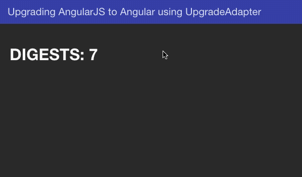

# UpgradeModule with Angular/AngularJS

***Note:*** *I had to retroactively update the `bower.json` file to include fixed versions for `angular-animate`, `angular-aria`, and
`angular-messages` due to an issue with some updated packages, so they appear as a part of every step comparison :(*

*There was also a memory leak in the `pureAngularjs` component which is not fixed in steps 1-5, fix is addressed
[here](https://github.com/jensbodal/ng1-ng2-hybrid/pull/11/files#diff-dc0248ff1bd622babf1fed7c5f2800b1)*

* [Step 1: Adding Angular](https://github.com/jensbodal/ng1-ng2-hybrid#step-1-adding-angular)
* [Step 2: Bootstrapping AngularJS from Angular](https://github.com/jensbodal/ng1-ng2-hybrid#step-2-bootstrapping-angularjs-from-angular)
* [Step 3: Modifying the build process](https://github.com/jensbodal/ng1-ng2-hybrid#step-3-modifying-the-build-process)
* [Step 4: Downgrading an Angular component](https://github.com/jensbodal/ng1-ng2-hybrid#step-4-downgrading-an-angular-component)
* [Step 5: Adding an Angular Route](https://github.com/jensbodal/ng1-ng2-hybrid#step-5-adding-an-angular-route)
* [Addendum 1: Angular zone.js $digest issues](https://github.com/jensbodal/ng1-ng2-hybrid#addendum-1-angular-digest-issues)


Back in April we made a decision to convert our AngularJS application to a hybrid Angular/AngularJS application.  We had a feeling that we wanted to move towards the newer framework and due to the development of a new shared component the opportunity arose to do so.

Here I will use what I learned and outline the steps needed to convert a sample application from Angular to AngularJS including the steps in between.

## Base AngularJS application

[ng1-ng2-hybrid](https://github.com/jensbodal/ng1-ng2-hybrid/tree/angularjs-base) (linked to angular.js base tag) is a simple angular.js application with two views.  One makes a call to a local nodejs server which mocks a response from GitHub's api (using a mocked version to facilitate ease in testing and to avoid getting rate limited).  The other view is just some silliness with showing a directive which randomly assigns a color to each letter in a string and utilizes an attribute directive as well as two services.

The code tries to follow [John Papa's AngularJS style guide](https://github.com/johnpapa/angular-styleguide/tree/master/a1), and now that his Angular guide [is the official Angular Style guide](https://github.com/johnpapa/angular-styleguide/tree/master/a2#angular-team-endorsed), we will use similar best practices when we start writing that code.

### Build Frameworks

* `npm@4.2.0`
* `bower@1.8.0`
* `grunt@1.0.1`
* [`package.json`](https://github.com/jensbodal/ng1-ng2-hybrid/blob/angularjs-base/package.json) (build/backend deps)
* [`bower.json`](https://github.com/jensbodal/ng1-ng2-hybrid/blob/angularjs-base/bower.json) (front-end deps)

This is what some might consider a *legacy* javascript application, we are using bower for front-end dependencies, npm for back-end and build dependencies, and grunt to wire everything together. Over the course of this example angular-cli/webpack and yarn will be introduced to facilitate our new Angular application.

## Step 0: Starting Point

Not much to do here.  Checkout the repo at tag `step-0` to see the branch at this state ([or view here](https://github.com/jensbodal/ng1-ng2-hybrid/tree/step-0)).

To build and run the AngularJS app simply run `grunt`.  It's recommended to keep this grunt tasking running in a separate shell through the entirety of this guide as it will continue to serve the app and update as files are changed.


## Step 1: Adding Angular

[Comparison from step-0 to step-1](https://github.com/jensbodal/ng1-ng2-hybrid/compare/step-0...step-1)

*You can checkout the repo at tag [`step-1`](https://github.com/jensbodal/ng1-ng2-hybrid/tree/step-1) to see the end result of what is detailed here*

Ok so we want to introduce Angular, where do we start? First off it's good to read through the official [Upgrading from AngularJS](https://angular.io/guide/upgrade) guide to become familiar with the process and the terminology used.  Some things to consider before embarking on this endeavor for your own applications:

* You might come across undocumented bugs or other issues that may or may not be fixable without a new version of Angular
* You might experience performance issues on hybrid pages that use 3rd party libraries
* You will need to find a new library for reusable components or create your own if your preferred one is not yet stable/available
* Many of the versions for dependencies will likely change after this writeup, some might be incompatible with the upgrade process regardless of *only* being minor/patch version bumps

### Dependencies

The following should be installed either has global dependencies or dependencies for your environment.  I have these installed globally

* [yarn](https://yarnpkg.com/en/docs/install) (**no longer supported as an npm package**)
* `angular-cli@1.1.0` (`yarn global add @angular/cli@1.1.0`


### Getting the initial angular files

For our examples, this repo is installed at: `~/github/ng1-ng2-hybrid`

First we are going to generate a temporary Angular application using the anguliar cli. We are going to grab some files from this newly generated application to then place into our own and modify.

```
# from the repository root
ng new ngExample --skip-install
mv ngExample/.angular-cli.json .
mv ngExample/tsconfig.json .
mv ngExample/tslint.json .
mv ngExample/src src/client
mv src/client/src src/client/ngsrc
```

Next we need to install anything that's in the new Angular app's package.json file into ours.

I highly recommend going through and fixing the package versions of the installed dependencies (e.g. instead of `"^2.3.4"` you use `"2.3.4"` (this is not necessary when using `yarn add -E` and a fixed version).  While semantic versioning should work in practice, you are placing all of your trust in the maintainer of that library to not introduce minor or patch bumps which don't break your hybrid app. You can install something like `node-check-update` to periodically check for new versions of installed packages and then update them after confirming nothing breaks.  If you install the exact package versions as listed below, this example should work just fine.  It will likely also work if you upgrade some of the packages, but upgrade each one individually so you know if a specific one breaks your app.

Here's what the Angular package.json looks like:

```
"dependencies": {
    "@angular/animations": "^4.0.0",
    "@angular/common": "^4.0.0",
    "@angular/compiler": "^4.0.0",
    "@angular/core": "^4.0.0",
    "@angular/forms": "^4.0.0",
    "@angular/http": "^4.0.0",
    "@angular/platform-browser": "^4.0.0",
    "@angular/platform-browser-dynamic": "^4.0.0",
    "@angular/router": "^4.0.0",
    "core-js": "^2.4.1",
    "rxjs": "^5.1.0",
    "zone.js": "^0.8.4"
},
"devDependencies": {
    "@angular/cli": "1.1.0",
    "@angular/compiler-cli": "^4.0.0",
    "@angular/language-service": "^4.0.0",
    "@types/jasmine": "2.5.45",
    "@types/node": "~6.0.60",
    "codelyzer": "~3.0.1",
    "jasmine-core": "~2.6.2",
    "jasmine-spec-reporter": "~4.1.0",
    "karma": "~1.7.0",
    "karma-chrome-launcher": "~2.1.1",
    "karma-cli": "~1.0.1",
    "karma-jasmine": "~1.1.0",
    "karma-jasmine-html-reporter": "^0.2.2",
    "karma-coverage-istanbul-reporter": "^1.2.1",
    "protractor": "~5.1.2",
    "ts-node": "~3.0.4",
    "tslint": "~5.3.2",
    "typescript": "~2.3.3"
}

```

Below are the fixed installations for the above files as of this writing.  You'll likely have versions of the test packages already installed, I'd recommend holding off on getting testing working until you've successfully bootstrapped your hybrid application.

```
export angularversion=4.2.2

# dependencies
yarn add -E core-js@2.4.1 \
rxjs@5.4.1 \
zone.js@0.8.12 \
@angular/core@$angularversion \
@angular/common@$angularversion \
@angular/compiler@$angularversion \
@angular/platform-browser@$angularversion \
@angular/platform-browser-dynamic@$angularversion \
@angular/forms@$angularVersion \
@angular/http@$angularVersion \
@angular/router@$angularVersion \
@angular/upgrade@$angularversion \
@angular/animations$angularVersion

# devDependencies
yarn add -ED typescript@2.3.4 \
@angular/cli@1.1.2 \
@angular/compiler-cli@$angularVersion \
@angular/language-service@$angularVersion \
@types/node@6.0.78 \
codelyzer@3.0.1 \
ts-node@3.0.6 \
tslint@5.4.3


# packages that will likely conflict with existing apps
# test that upgrading these versions don't break what you already do
# recommended to hold off on these until your app is working with the UpgradeModule
yarn add -ED jasmine-core@2.6.3 \
jasmine-spec-reporter@4.1.0 \
karma@1.7.0 \
karma-chrome-launcher@2.1.1 \
karma-cli@1.0.1 \
karma-coverage-istanbul-reporter@1.3.0 \
karma-jasmine@1.1.0 \
karma-jasmine-html-reporter@0.2.2 \
protractor@5.1.2 \
@types/jasmine@2.5.52
```

Now that our dependencies are installed, we need to update some of the files that we pulled in from our example application.

We'll need to edit `.angular-cli.json`, `tsconfig.json`, and `src/client/ngsrc/tsconfig.app.json`

I'll use vim:

`vim -p .angular-cli.json tsconfig.json src/client/ngsrc/tsconfig.app.json`

**.angular-cli.json**

```
# changes
"root": "src/client/ngsrc"
"outDir": "dist/ng",
"lint": [
    {
      "project": "src/client/ngsrc/tsconfig.app.json"
    },
    {
      "project": "src/client/ngsrc/tsconfig.spec.json"
    },
```

**tsconfig.json**

```
"baseUrl": "src/client/ngsrc",
```

**src/client/ngsrc/tsconfig.app.json**

**NOTE:** As of `@angular/cli@1.1.0` the new `paths` key needs to be added to `compilerOptions`.  Otherwise the only change is to update the relative path for `extends`.

```
{
  "extends": "../../../tsconfig.json",
  "compilerOptions": {
    ...
    "paths": {
      "@angular/*": [
        "../../../node_modules/@angular/*"
      ]
    }
  },
  ...
}
```

[You can see a summary of the above changes here](https://github.com/jensbodal/ng1-ng2-hybrid/commit/acaa2672571dd05eb725bc266bea472274271a3e)

You should now be able to run `ng build` and see that the example app builds with our new structure.  If following along with the repo, add a new static route in `src/client/server/app.js` for: `app.use(express.static('./dist/ng'));`, you can now load the example app at `127.0.0.1:6677/dist/ng`.  You won't need this route for our purposes so feel free to remove it after testing.

Grunt should already be running in a separate shell and serving the AngularJS app.  Open another shell, and leave `ng build --watch` running so that changes to the Angular files will be watched and the builds updated as they change.


## Step 2: Bootstrapping AngularJS from Angular

[Comparison from step-1 to step-2](https://github.com/jensbodal/ng1-ng2-hybrid/compare/step-1...step-2)

Now that all the files are in place to build the Angular application, we will need to make some modifications to our original code in order to bootstrap AngularJS from the Angular app.  We will not be using the `index.html` file inside of the `ngsrc` folder, instead we will just be using the generated bundles from `dist/ng`.

Open the `index.html` file in `dist/ng` and copy the script tags and place at the bottom of the `src/client/index.html` file then update the paths.  If using in your own app, then just make sure these are placed last and in the same order.  **Remember to update the paths to reflect dist/ng**.

**src/client/index.html**

```

...

<body ng-app="angularSeed" ng-strict-di>
    <div class="angular-seed-main" ui-view="angularSeedMain"></div>

...

<script type="text/javascript" src="dist/ng/inline.bundle.js"></script>
<script type="text/javascript" src="dist/ng/polyfills.bundle.js"></script>
<script type="text/javascript" src="dist/ng/styles.bundle.js"></script>
<script type="text/javascript" src="dist/ng/vendor.bundle.js"></script>
<script type="text/javascript" src="dist/ng/main.bundle.js"></script>
</body> <!-- place the script tags above the closing body tag -->
```

Next we need to change how AngularJS is bootstrapped. We'll remove the `ng-app` and `ng-strict-di` attributes from the body tag, and instead bootstrap AngularJS from our new Angular app.  We are leaving in place the initial `ui-view` tag as I am using `ui-router` and this tells the app where to start.


**src/client/index.html**

```

...

<body>
    <div class="angular-seed-main" ui-view="angularSeedMain"></div>

...
```

The final step is to now go into the `app.module.ts` file (`src/client/ngsrc/app/app.module.ts`) and remove `AppComponent` from the declarations and bootstrap arrays.  This is telling Angular that `AppComponent` is a member of this module, and that it can be the initial component view when loading Angular.  This will come into play again later when we add routing support, but for now remove it and instead tell the module that we are going to bootstrap AngularJS instead.

**app.module.ts**

```
import { BrowserModule } from '@angular/platform-browser';
import { NgModule } from '@angular/core';
import { UpgradeModule } from '@angular/upgrade/static';

import { AppComponent } from './app.component';

@NgModule({
  declarations: [
  ],
  imports: [
    BrowserModule,
    UpgradeModule
  ],
  providers: [
  ],
  bootstrap: [
  ]
})

export class AppModule {
  constructor(private upgrade: UpgradeModule) { }

  ngDoBootstrap() {
    this.upgrade.bootstrap(document.body, ['angularSeed'], {strictDi: true})
  }
}
```

Assuming you have `grunt` and `ng build --watch` running (otherwise run `ng build`, and then `grunt`), you should be able to now see that your app is being bootstrapped from Angular.  Congratulations, you now have a hybrid Angular/AngularJS app!


## Step 3: Modifying the build process

[Comparison from step-2 to step-3](https://github.com/jensbodal/ng1-ng2-hybrid/compare/step-2...step-3)

It will probably be most helpful to just check out the comparison between steps 2 and 3 to see the changes that were added to support
building the Angular application along side AngularJS using grunt. The primary changes being made and how the process works:

* Angular and AngularJS apps are built separately
* `grunt-injector` is used to wire up the bundled Angular files into the `index.html` file
* `dev` and `prod` builds output to separate folders to ease in the wiring up process
* all used `ng build` commands are wrapped into npm script commands within `package.json`
* the `ng build --watch` wrapped command is added to our default concurrent tasks


## Step 4: Downgrading an Angular component

[Comparison from step-3 to step-4](https://github.com/jensbodal/ng1-ng2-hybrid/compare/step-3...step-4)

Whew.  Our app is now running Angular/AngularJS side-by-side and it's integrated into our build process, so let's write some Angular code!


For our first Angular component I will rewrite the `src/client/app/github/github.fileInfoCard.component.js` in Angular, downgrade it, then simply use it in AngularJS.

***Note:*** *You might notice that the [`github.fileInfoCard.component`](https://github.com/jensbodal/ng1-ng2-hybrid/blob/step-3/src/client/app/github/github.fileInfoCard.component.js#L16) is incorrectly dependent on the `githubApi` service. Step-4 removes this unused dependency.*

For the first component that's downgraded there is a bit of scaffolding that needs to be done, subsequent downgraded components will be significantly easier to downgrade.

### Changes

There are a lot of changes here, it's best to view the [comparison from step-3 to step-4](https://github.com/jensbodal/ng1-ng2-hybrid/compare/step-3...step-4) to see all of the changes, however they will be summarized below, with some steps expanded on.

* **.angular-cli.json** updated to use Sass to conform with what is setup on the AngularJS side, also updated our app prefix to `aseed`
* **package.json** `@types/angular` added (explained in the downgrade section)
* **app.module.js** AngularJS app module updated to include our Angular downgrade module (explained in downgrade section)
* **github.component.html** our `aseed-file-info-card` component we are creating is now placed in an Angular Material `md-card` as we have not implemented `@angular/material2` or another replacement
* **github.fileInfoCard.component.html** removed as no longer needed
* **github.fileInfoCard.component.js** removed as no longer needed
* **index.html** removed `github.fileInfoCard.component.js` since we are no longer using it
* **app.module.ts** updated to include our downgraded component (explained in downgrade section)
* **downgrades.ts** new file to specify which of our Angular components and services will be downgraded
* **fileInfoCard.component.\*** newly rewritten component (explained in rewrite section)
* **githubFileInfo.ts** new class for specifying the layout of our githubFileInfo which is used in the display
* **github.module.ts** declares our rewritten component, imports pipes used and the CommonModule (which includes `*ngFor` among other things)
* **object.pipe.ts** `*ngFor` doesn't allow iterating through objects like `ng-repeat` does, so we create our own pipe to recreate this functionality
* **pipes.module.ts** pipes need to be declared and exported from a module in order to be used
* **tsconfig.app.json** updated to include our `angular` types (see `@types/angular` section)
* **src/client/scss/style.scss** removed `githubFileInfoCard` styles used in AngularJS
* **tslint.json** updated our directive and component selector to `aseed` to be enforced in linting

### @types/angular

We are going to use the `angular` object in various places (namely `downgrades.ts` here) when working with the `UpgradeModule`. In order to make our linting and build process happy, we need to add the `@angular/types` module and include the type in our `tsconfig.app.json`.

```
yarn add -ED @types/angular
```

**tsconfig.app.json**

```
  "compilerOptions": {
    "types": ["angular"],
```


### Rewriting the githubFileInfo Component

Our AngularJS application relies on `@angular/material` for display components, so to make things easy for this step we are simply going to wrap the new fileInfo component in an `md-card` component rather than have it do that itself (as it was done [previously](https://github.com/jensbodal/ng1-ng2-hybrid/blob/step-3/src/client/app/github/github.fileInfoCard.component.html)).

**Note:** *While I'll include the process of rewriting the component in this section, the recommended steps for your first downgraded component are to just create a basic working component, downgrade it, then show that it works.  [Here you can see the commit where I did this](https://github.com/jensbodal/ng1-ng2-hybrid/commit/bdbecdfd5d56a45a0e4992c3d5805d06ae2b92fa).*


Ideally you are already using components in AngularJS, components became available in [version 1.5](https://github.com/angular/angular.js/blob/master/CHANGELOG.md#features-11). Much of the syntax and style is quite similar to components in Angular, below is an annotated version of the rewritten component.

```
/**
 * Component: required for the @Component annotation
 * Input: required for binding attributes in the template to the class
 * OnChanges: similar to AngularJS component's $onChanges lifecycle hook
 */
import { Component, Input, OnChanges, SimpleChanges } from '@angular/core';

/**
 * GithubFileInfo: a new class to handle the details of what this object represents
 */
import { GithubFileInfo } from './githubFileInfo';

@Component({
  /* these are fairly straightforward */
  selector: 'aseed-file-info-card',
  templateUrl: './fileInfoCard.component.html',
  styleUrls: ['./fileInfoCard.component.scss']
})

/* we need to explicitly implement OnChanges and/or OnInit if we want to use them */
export class FileInfoCardComponent implements OnChanges {

  /**
     What we had in angularJS:

     bindings: {
        fileInfo: '<'
      },

     becomes:
   */
  @Input() fileInfo: GithubFileInfo;

  /* modifier 'public' means it will be available for use in the template */
  public patchInfo: string;

  /* executed when the class is instantiated */
  constructor() {}

  /**
   * not used: ngOnInit -- called after component is initialized and after constructor
   * https://angular.io/api/core/OnInit
   */

  /* Called before ngOnInit() and whenever one or more data-bound input properties change */
  ngOnChanges(changes: SimpleChanges): void {
    if (changes.fileInfo && changes.fileInfo.currentValue) {
      // instead of having the logic for handling the fileInfo, we create a GithubFileInfo
      // class and have it take care of what it is supposed to do
      const fileInfo = new GithubFileInfo(changes.fileInfo.currentValue);

       // formatPatch method from AngularJS component also moved to GithubFileInfo class
      if (fileInfo.patch) {
        this.patchInfo = fileInfo.patch;
      }
    }
  }
}
```

Instead of specifying the type of binding in the component like we did with AngularJS:


| syntax | type of binding |
|---|---|
|`<`|one-way binding|
|`=`|two-way binding|
|`@`|string/value/interpolated binding|
|`&`|expression binding|

Angular uses `@Input()` and `@Output()` for bindings and 'events', or better put, for inputs and outputs to the component.

When using the component, you specify the *type* of binding with how the attribute is declared. See the below table for reference:

| syntax | type of binding |
|---|---|
|`[attribute]`|one-way binding |
|`(attribute)`|event/output binding |
|`[(attribute)]`|banana-in-a-box/two-way binding |

For the purposes of this demonstration we will only be using one-way binding with `@Input()` and `[attribute]`.  Also note that "*most AngularJS two-way bindings actually only need a one-way binding in practice,* `<my-component [myValue]="anExpression">` *is often enough*" ([Angular upgrade guide](https://angular.io/api/upgrade/static/UpgradeComponent)).


#### The Component's Template

The template for the rewritten component are nearly identical. The biggest difference is the use of `*ngFor` which replaces `ng-repeat`. AngularJS's `ng-repeat` had quite a few built in filters and features which are not available with `*ngFor`.  One of the biggest differences is that you can not iterate through an object's keys and values like you could with `ng-repeat`, for that purpose I have written a `pipe` called `object` which returns `item` as an array of objects with 'key' and 'value' properties.


**Before**

```
<md-card>
    <div ng-repeat="(key, value) in vm.fileInfo">
        <span class="key-value">{{ key }}:</span> {{ value }}
    </div>
    <pre>{{vm.patchInfo}}</pre>
</md-card>
```

**After**

```
<div>
  <div *ngFor="let item of fileInfo | object:'patch'">
    <span class="key-value">{{ item.key }}:</span> {{ item.value }}
  </div>

  <pre>{{patchInfo}}</pre>
</div>
```

**Pipes???** I thought pipes were evil??? Angular now has the notion of [**pure** and **impure** pipes](https://angular.io/guide/pipes#pure-and-impure-pipes). The discussion and implementation of the pipe used here is outside the scope of this writeup, but I'll sum up the differences with what is listed in the linked Angular guide:

* pure pipe execute only when it detects a pure change to the input value
* a pure change is either a change to a primitive input value (`String`, `Number`, `Boolean`, `Symbol`) or a changed object reference (`Date`, `Array`, `Function`, `Object`)
* impure pipes are executed during every component change detection cycle
* an impure pipe is called often, as often as every keystroke or mouse-move

The same way you *can* do two-way bindings with component attributes, you can create impure pipes similar to AngularJS, but unless done correctly and for the right purpose, performance will suffer.

Also note that there are many pipes available by default like there were with AngularJS, [see here for some examples](https://angular.io/guide/pipes#appendix-no-filterpipe-or-orderbypipe).

Lastly note that in order to use a pipe in your component, the pipe needs to be part of a module, and that module needs to be in the context of the module that your component is declared in. Here I've added the `ObjectPipe` to the `PipesModule` and imported `PipesModule` into the `GithubModule`.  If I wanted the `ObjectPipe` to be available app-wide, I could import it into the main `AppModule`.

**CSS**

At the beginning of this step we switched over to using sass, something that could have been done when we initially added Angular but I didn't do because I forgot :)

The sass file, like the template file, is [nearly identical](https://github.com/jensbodal/ng1-ng2-hybrid/compare/step-3...step-4#diff-b66c9f29ac5f593f170f95bfdd04fc65). We simply swap out the `github-file-info-card` selector for the [`:host`](https://angular.io/guide/component-styles#host) selector. The `:host` selector is the only way to target the host (component) element.

#### Github Module

The last step is to include the component into a module so that it can be used. Here I'll create the main GithubModule which will house the other components if/when they are rewritten.

```
import { NgModule } from '@angular/core';
import { CommonModule } from '@angular/common';

import { PipesModule } from '../pipes/pipes.module';
import { FileInfoCardComponent } from './fileInfoCard/fileInfoCard.component';

@NgModule({
    imports: [
        CommonModule,
        PipesModule
    ],
    declarations: [
        FileInfoCardComponent
    ],
    exports: [
        FileInfoCardComponent
    ]
})

export class GithubModule { }
```

### Downgrade Module

In the `ngsrc/app` folder create a file called `downgrades.ts`. This file will serve as the soul source of all of our downgraded components and services which will be used in AngularJS. Multiple downgraded directives and services can simply be chained together and all of them will be included and accessible from AngularJS in the `ng.downgrades` module.

#### [downgrades.ts](https://github.com/jensbodal/ng1-ng2-hybrid/compare/step-3...step-4#diff-9b8bacd63e0cf6ee57e7f115fd8a5387)

```
import { downgradeComponent, downgradeInjectable } from '@angular/upgrade/static';

// our components
import { FileInfoCardComponent } from './github/fileInfoCard/fileInfoCard.component';

// our services
/* empty */

declare var angular: angular.IAngularStatic;

// this is the module that will need to be included in our AngularJS application
angular.module('ng.downgrades', [])
  .directive(
    'aseedFileInfoCard',
    downgradeComponent({
      component: FileInfoCardComponent,
      inputs: [
        'fileInfo'
      ],
    }) as angular.IDirectiveFactory
  )
;
```


#### [app.module.ts](https://github.com/jensbodal/ng1-ng2-hybrid/compare/step-3...step-4#diff-dbb539c917ba74ef6c5bed31a684680d)

In our app module we now need to include `downgrades.ts` which specifies an AngularJS module `ng.downgrades`.  We then include this module in the bootstrap portion of the app module.

```
ngDoBootstrap() {
    this.upgrade.bootstrap(document.body, ['angularSeed', 'ng.downgrades'], {strictDi: true})
}
```


Final `app.module.ts`

```
import { BrowserModule } from '@angular/platform-browser';
import { NgModule } from '@angular/core';
import { UpgradeModule } from '@angular/upgrade/static';

import { AppComponent } from './app.component';

// components/services that are being downgraded need to be added to our main app module's entryComponents/providers
// their respective modules added to our imports
import { GithubModule } from './github/github.module';
import { FileInfoCardComponent } from './github/fileInfoCard/fileInfoCard.component';

// import all of our downgraded components and services
import './downgrades';

@NgModule({
  imports: [
    BrowserModule,
    GithubModule,
    UpgradeModule
  ],
  declarations: [
    AppComponent
  ],
  entryComponents: [
    FileInfoCardComponent
  ],
  providers: [
    { provide: 'githubApi', useExisting: 'githubApiProvider' }
  ],
  bootstrap: [
  ]
})

export class AppModule {
  constructor(private upgrade: UpgradeModule) { }

  ngDoBootstrap() {
    this.upgrade.bootstrap(document.body, ['angularSeed', 'ng.downgrades'], {strictDi: true})
  }
}

```

## Step 5: Adding an Angular Route

[Comparison from step-4 to step-5](https://github.com/jensbodal/ng1-ng2-hybrid/compare/step-4...step-5)

The most effective way of upgrading your application is to actually replace entire routes with pure Angular code. Depending on what
services, directives, and components your route is dependent on, this could be a fairly large undertaking. Here I will simply show you how
to add the scaffolding necessary to use the Angular Router along side AngularJS's ui-router, and how to tell each one when to take over the
routing. We will also set up a simple example route to show that our new Angular routes are working.

*If you're using the AngularJS angular router and* `ng-view`*, I've read the steps are quite similar, however you might want to look
[here](http://blog.lssinc.com/2017/05/23/from-angularjs-to-angular-upgrading-made-simple-with-upgrademodule-and-webpack/) or
[here](https://vsavkin.com/migrating-angular-1-applications-to-angular-2-in-5-simple-steps-40621800a25b) to see examples of that.*

**What we'll do**

* Change the way we bootsrap `ui-router` and AngularJS by using our `AppComponent` instead of bootstrapping in `index.html`
* Create a new `app-routing.module.ts` module, `AppRoutingModule`, and define our base `router-outlet` and default route definitions
* Add `AppRoutingModule` to our `AppModule`
* Implement and use a `UrlHandlingStrategy` to say when Angular will handle routes
* Add `router-outlet` to our root `AppComponent`
* Make `ui-router` aware of our Angular routes and tell it to ignore them by using an empty template
* Add our example Angular route and component!

### Changing the way we bootstrap, using the AppComponent

This step is relatively simple. Instead of bootstrapping AngularJS purely from the AppModule, we declare our Angular AppComopnent as a `bootstrap` component and then call that from our index.html, similar to how it would be done in a pure AngularJS/Angular application.  AngularJS is now bootstrapped as part of the process of including the AppComponent.

```
<!-- because we are loading our header here now, we need the ng-cloak attribute to wait for css -->
<body ng-cloak>
    <angular-seed-header></angular-seed-header>

    <aseed-root></aseed-root>

    <div class="angular-seed-main" ui-view="angularSeedMain"></div>
```

Some logic has been refactored on where the header is included in our site, this could just as easily be a ui-view which could be configured elsewhere to hide/show the header as needed. Our main angular app component's template contains only the line:

```
<router-outlet></router-outlet>
```

This starts up the process of handling routes within Angular.  We also need to make some changes to the AppModule file to tell Angular how we'll be handling the routes and also specifying that we are using the `HashLocationStrategy`. Using the hash location strategy simplifies dividing the routes between angular and angularjs.

So what happens now is that AngularJS's ui-router is the primary router, we need to define paths in both the ui-router and an Angular's router if we want Angular to handle them. To accomlish this we'll introduce a new `angularSeed.angularRoutes` module which contains `AngularRoutesConfig` to handle the Angular routes.  Without this ui-router's `$urlRouterProvider.otherwise('/');` definition in `layout.config.js` would take precedence and redirect us to the homepage.

**angularRoutes.config.js**

```
  function AngularRoutesConfig($stateProvider) {
    $stateProvider
      .state('helloWorld', {
        url: '/hello-world',
        // use empty template because ui-router needs something to show
        // Angular component will take over though
        template: ''
      })
      .state('undefinedAngularRoute', {
        url: '/undefined-angular-route',
        template: ''
      });
```

We define the routes in AngularJS with an empty template so that it can recognize the route and then display an empty template.  In Angular we then match these routes with our `UrlHandlingStrategy` implementation.

**app.module.ts**

```

export class AngularUrlHandlingStrategy implements UrlHandlingStrategy {
  shouldProcessUrl(url: UrlTree): boolean {
    switch (url.toString()) {
      case '/hello-world':
      case '/undefined-angular-route':
        return true;
      default:
        return false;
    }
  }

  extract(url: UrlTree): UrlTree {
    return url;
  }

  merge(url: UrlTree, whole: UrlTree): UrlTree {
    return url;
  }
}

...

  providers: [
    { provide: APP_BASE_HREF, useValue: '/' },
    { provide: LocationStrategy, useClass: HashLocationStrategy },
    { provide: UrlHandlingStrategy, useClass: AngularUrlHandlingStrategy }
  ],
```

This simply tells Angular that it should be handling these routes, but it doesn't tell it how to define the routes.  For that we introduce the `app-routing.module`.

**app-routing.module**

```
export const routes: Routes = [
  { path: '**', component: PageNotFoundComponent }
];

@NgModule({
  imports: [
    ErrorHandlingModule,
    HelloWorldRoutingModule,
    RouterModule.forRoot(
      routes,
      { enableTracing: true } // <-- for debugging purposes only
    )
  ],
  exports: [RouterModule]
})

export class AppRoutingModule { }
```

The `**` path is similar to the `$urlRouterProvider.otherwise` functionality of ui-router, it will match any unmatched routes.  For this reason the wildcard route should always go **after** the definition of all   other routes, otherwise it will always match as soon as it's seen. Other routes could be defined above this route, or if you'd like to decompose the logic a bit more, you can include those other routing modules above the definition of the `forRoot` definition in the AppRoutingModule's imports (as above).

These are the basics for deciding how to handle the routes in your hybrid application.  You can take a look at the implementation of the other routing modules and component templates to see how they work.


# Addendum 1: Angular $digest issues

If you upgrade a larger application you might notice some immediate performance issues. One of the biggest issues with the current state of the `UpgradeModule` is the way "*Angular uses Zone.js to create its own zone (NgZone), which monkey-patches all asynchronous events (browser DOM events, timeouts, AJAX/XHR). This is how change detection is able to automatically run after each asynchronous event. I.e., after each asynchronous event handler (function) finishes, Angular change detection will execute [source](https://stackoverflow.com/a/35469104/679716).*"

This is an issue actively being addressed and is discussed in [Jeff Cross's talk](https://drive.google.com/file/d/0Bw6GBXhPGkUGUWFLNFBlUkM5Tms/view) in the **Zones** section.  At the time of this writing there is not a video available for this talk, but if one becomes available I will link to it here.

Essentially, to write code that won't trigger digests in AngularJS you need to add native javascript event handlers. Many libraries will often do this in order to handle events in their own way, such as AngularMaterial. The problem is that when using the UpgradeModule these event handlers are "patched" to now trigger &#36;digests. This can become quite problematic for a library such as AngularMaterial which has event handlers for mouse movements: with a hybrid app that uses AngularJS AngularMaterial a digest will now be triggered [every time the mouse is moved](https://github.com/angular/material/issues/10636).

We can observe this behavior by using something like batarang or just adding some simple code to our main template and controller.

**main.component.html**

```

<div class="main-container">
    <h1>DIGESTS: <span id="digest-count">0</span></h1>
```

**main.component.js**

```
MainController.$inject = ['$scope'];

function MainController($scope) {
  var digestCount = 0;

  $scope.$watch(updateDigestCount);

  function updateDigestCount() {
    document.getElementById('digest-count').textContent = ++digestCount;
  }
}
```

Now on all our pages we will see the total number of digests ran since starting the application.

Alternatively, you could just log the digest counts to the console by pasting this in:

```
var count = 0;
function incrementAndUpdateCount() { console.log(++count); };
angular.element(document.body).injector().get('$rootScope').$watch(incrementAndUpdateCount);
```

**BEFORE**


One solution is to grab all the event handlers that you want to run outside of the Angular zone, deregister them, then re-register them outside the Angular zone.  We can do this in the run block of setting up our angularjs application.

**app.run.js**

```
(function() {
  'use strict';

  angular
    .module('angularSeed')
    .run(bindEventsToParentZone);

  bindEventsToParentZone.$inject = ['$window'];

  function bindEventsToParentZone($window) {
    // grab a copy of existing events in this zone
    var existingEventsObj = angular.copy(angular.element._data(angular.element(document)[0])['events']);
    // *NOTE* if using angular 1.5.x you might need this instead:
    // angular.element._data(angular.element(document)[0], 'events')
    // and the handlerFunction names are namespaced as event.handler.name

    angular.element(document).off();

    angular.forEach(existingEventsObj, function(eventsForEventName, eventName) {
      angular.forEach(eventsForEventName, function(event) {
        if (_isEventToRunoutsideZone(event)) {
          $window.Zone.current.parent.run(function() {
            angular.element(document).on(eventName, event);
          });
        }
        else {
          // bind all other events back to current zone (where they were)
          $window.Zone.current.run(function() {
            angular.element(document).on(eventName, event);
          });
        }
      });
    });
  }

  function _isEventToRunoutsideZone(event) {
    var handlerFunctionName = event.name;

    var handlerFunctionNamesToRunOutsideZone = [
      'gestureStart',
      'gestureMove',
      'gestureEnd',
      'gestureClearCache'
    ];

    return (
      handlerFunctionNamesToRunOutsideZone.indexOf(handlerFunctionName) !== -1
    );
  }
})();
```

Here the events we grab are the event handler function names from AngularMaterial. We take those and re-register them in the parent zone, and the rest we re-register them in the current zone (the angular zone).

**AFTER**



[See pull request which introduced this code](https://github.com/jensbodal/ng1-ng2-hybrid/pull/10/files)
